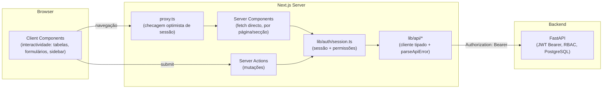
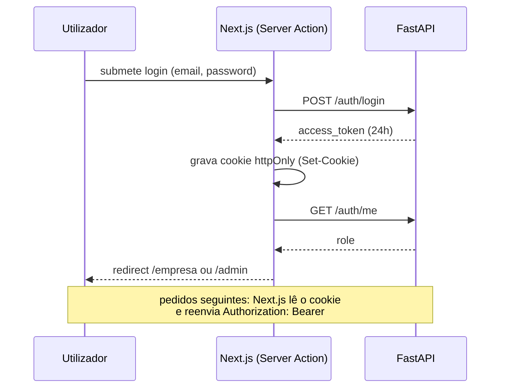

# Arquitetura Frontend — C-Trip Dashboard (Gestor + Admin)

> Baseado em `Docs/C-Trip_Guia_Frontend.pdf` (endpoints, contratos, erros) e `Docs/C-Trip_Guia_UIUX.pdf` (jornadas, prioridades de produto). Este documento cobre exclusivamente os dois perfis que este projecto (`c-trip-dashboard`) serve: **Gestor da Empresa** e **Administrador da Plataforma**. Passageiro/Operador/Público pertencem à app de marketplace, não a este dashboard.

## 0. Stack já existente (ponto de partida)

| Camada | Escolha já feita no repo |
|---|---|
| Framework | Next.js **16.3** (App Router) — atenção: esta versão renomeou `middleware.ts` → `proxy.ts` e mudou o modelo de cache ("Cache Components"). Ver `AGENTS.md`. |
| UI runtime | React 19.2 |
| Linguagem | TypeScript `strict: true` |
| Estilos | Tailwind CSS v4 |
| Design system | shadcn/ui, estilo `base-nova`, ícones `@tabler/icons-react` (`components.json`) |
| Qualidade | ESLint 9, Prettier, Husky + lint-staged, Commitlint (Conventional Commits) |
| Testes | Vitest + Storybook (`addon-vitest`, `addon-a11y`), Playwright já como devDependency |
| Gestor de pacotes | pnpm |

Nada disto muda. A arquitetura abaixo **estende** o que já está montado — não propõe trocar de framework nem de design system.

---

## 1. Decisão de arquitetura

**Server-first, modular por domínio, com autorização centralizada.**

- **App Router com Server Components como camada de dados por omissão.** Os dados deste dashboard são quase todos privados e por-sessão (rotas, frota, colaboradores, pagamentos da empresa, empresas pendentes, utilizadores da plataforma). Buscar isso directamente no servidor evita expor o JWT ao JavaScript do browser e evita duplicar lógica de fetch em client components.
- **Server Actions para todas as mutações** (criar rota, atribuir permissões, aprovar empresa, etc.), em vez de rotas de API + fetch manual no cliente. O formulário chama a acção directamente; validação e chamada à API FastAPI vivem no mesmo sítio.
- **Autorização é uma camada, não um `if` espalhado.** Um único módulo (`lib/auth/session.ts`) decide "quem és" e "o que podes"; todo o resto (nav, layouts, Server Actions) consulta essa camada em vez de reimplementar RBAC.
- **Estrutura de pastas por domínio** (`rotas`, `frota`, `colaboradores`, `empresas`, `pagamentos`...), não por tipo de ficheiro — cada feature é dona dos seus componentes, acções e schema de validação.
- **shadcn/ui como sistema de componentes primitivos**; componentes de produto (tabela, sidebar, badge de estado) construídos uma vez em `components/dashboard` e `components/tables`, reutilizados nos dois perfis.

**Porquê esta escolha e não outra:** o backend (FastAPI) já faz autenticação, RBAC granular e validação — o frontend não precisa de um cliente de estado global pesado (Redux/Zustand) nem de uma camada GraphQL. O risco real deste projecto não é "gerir estado complexo no cliente", é **not tratar bem as inconsistências documentadas no guia de integração** (token sem refresh, dois formatos de erro, endpoints que substituem em vez de somar, query-string vs JSON inconsistente). Por isso a arquitectura investe deliberadamente numa camada de API tipada e numa camada de sessão/autorização centralizadas — é aí que os bugs de produção deste tipo de API costumam nascer.



---

## 2. Autenticação e sessão

O backend emite um JWT que **dura 24h e não tem refresh token** — isto é uma decisão de arquitectura, não um detalhe de UI.

1. `POST /auth/login` (ou `/auth/google`) é chamado a partir de uma Server Action ou Route Handler (`app/api/auth/login/route.ts`) — nunca directamente do browser.
2. O `access_token` devolvido é guardado num **cookie `httpOnly`, `secure`, `sameSite=lax`**, com `expires` alinhado aos 24h. O token nunca é exposto a JavaScript do cliente.
3. Todas as chamadas subsequentes ao backend (feitas em Server Components / Server Actions) lêem o cookie via `cookies()` e reenviam `Authorization: Bearer <token>`.
4. **Sem refresh token** → um wrapper central de fetch (`lib/api/client.ts`) intercepta qualquer resposta `401`, apaga o cookie e redirecciona para `/login?expired=1`. O ecrã de login mostra "A tua sessão expirou — entra novamente", nunca um erro genérico.
5. `proxy.ts` (não `middleware.ts` — ver nota da stack) faz apenas a **verificação optimista**: existe cookie de sessão? Se não, redirecciona `/empresa/*` e `/admin/*` para `/login`. Não decide permissões — os docs do próprio Next.js 16 avisam que Server Actions podem contornar o `matcher` do proxy, por isso a autorização real vive sempre na camada de sessão (`lib/auth/session.ts`), verificada de novo em cada layout/Server Action.



Não existe "esqueci-me da password" na API — a UI não promete recuperação automática; o ecrã de login tem apenas um link de contacto/suporte manual, conforme o aviso do guia de produto.

---

## 3. Autorização (RBAC) na UI

`GET /auth/my-permissions` devolve a lista de códigos (`route:create`, `boarding:validate`, ...). `role === "admin"` é sempre bypass total. Isto fica centralizado assim:

```ts
// lib/auth/session.ts (server-only, cache() por pedido)
export const getSession = cache(async () => { /* lê cookie, decide autenticado/não */ })
export const getPermissions = cache(async () => { /* GET /auth/my-permissions */ })
export function can(code: PermissionCode) { /* role==='admin' || permissions.includes(code) */ }
export async function requireAuth() { /* redirect('/login') se não autenticado */ }
export async function requirePermission(code: PermissionCode) { /* requireAuth + can(code) ou forbidden() */ }
```

Regras:

- **Nunca** enviar o catálogo de permissões todo para o cliente. Um Server Component filtra a navegação (`config/nav.ts`, lista de `{ href, label, icon, permission }`) e só passa ao `<Sidebar>` (Client Component) os itens já autorizados.
- Cada `layout.tsx`/`page.tsx` de uma secção chama `requirePermission("route:read")`, etc. — mesmo que a navegação já esconda o link, o acesso directo por URL tem de ser bloqueado no próprio segmento (é o padrão que a própria documentação do Next.js recomenda: nunca confiar só em esconder UI).
- **Duas armadilhas de segurança que o guia identifica no backend ainda por corrigir** ficam encapsuladas em flags, não espalhadas em `if`s:
  - Empresa `pending`/`suspended` não é bloqueada em todas as acções → `<CompanyStatusBanner>` fica sempre visível no shell do Gestor quando `company.status !== "verified"`, independentemente de a acção em causa estar de facto bloqueada.
  - "Roles da Empresa" permite atribuir a role global `gestor` (acesso total) sem restrição → escondido atrás de `config/flags.ts: ENABLE_GLOBAL_ROLE_ASSIGNMENT = false`, para reactivar com uma linha quando o backend corrigir.

---

## 4. Estrutura de pastas

```
c-trip-dashboard/
├─ app/
│  ├─ (auth)/                        # sem sidebar, layout mínimo
│  │  ├─ login/page.tsx
│  │  ├─ registo-empresa/page.tsx    # POST /companies/register
│  │  └─ layout.tsx
│  │
│  ├─ (dashboard)/
│  │  ├─ layout.tsx                  # requireAuth(); decide shell
│  │  │
│  │  ├─ empresa/                    # ── GESTOR ──
│  │  │  ├─ layout.tsx               # requireAuth + nav filtrada por permissão
│  │  │  ├─ page.tsx                 # dashboard/overview
│  │  │  ├─ rotas/
│  │  │  │  ├─ page.tsx              # GET /routes/company
│  │  │  │  ├─ nova/page.tsx         # POST /routes/
│  │  │  │  ├─ actions.ts
│  │  │  │  └─ _components/
│  │  │  ├─ horarios/                # GET/POST /schedules/*
│  │  │  ├─ frota/
│  │  │  │  ├─ autocarros/           # /fleet/buses
│  │  │  │  └─ motoristas/           # /fleet/drivers
│  │  │  ├─ colaboradores/
│  │  │  │  ├─ page.tsx              # GET/POST /companies/users
│  │  │  │  └─ [userId]/
│  │  │  │     ├─ permissoes/page.tsx  # /companies/users/{id}/permissions
│  │  │  │     └─ roles/page.tsx       # /companies/roles/*
│  │  │  ├─ pagamentos/page.tsx      # GET /payments/company
│  │  │  └─ perfil/page.tsx          # PATCH /companies/profile
│  │  │
│  │  └─ admin/                      # ── ADMIN ──
│  │     ├─ layout.tsx               # requireAuth + role==='admin'
│  │     ├─ page.tsx
│  │     ├─ empresas/
│  │     │  ├─ page.tsx              # tabs: pendentes | todas
│  │     │  └─ [companyId]/page.tsx  # aprovar/rejeitar/suspender
│  │     ├─ utilizadores/page.tsx    # GET /admin/users
│  │     ├─ pagamentos/page.tsx      # GET /admin/payments + confirmar manual
│  │     ├─ auditoria/page.tsx       # GET /admin/audit-log
│  │     └─ configuracoes/roles/     # RBAC global — uso raro, sem destaque na nav
│  │
│  ├─ api/auth/{login,google,logout}/route.ts   # gestão do cookie httpOnly
│  └─ layout.tsx                     # root layout (existente)
│
├─ lib/
│  ├─ api/
│  │  ├─ client.ts                   # fetch central: baseURL, Bearer, parseApiError, 401→logout
│  │  ├─ errors.ts                   # ApiError { status, fieldErrors? , message }
│  │  ├─ auth.ts · companies.ts · routes.ts · schedules.ts
│  │  ├─ fleet.ts · payments.ts · admin.ts
│  ├─ auth/
│  │  ├─ session.ts                  # DAL: getSession, can(), requirePermission
│  │  └─ permissions.ts              # tipos dos códigos de permissão
│  └─ utils.ts                       # (existente)
│
├─ components/
│  ├─ ui/                            # shadcn (existente: button.tsx, ...)
│  ├─ dashboard/                     # Sidebar, Topbar, CompanyStatusBanner
│  ├─ forms/                         # FormField, PermissionChecklist
│  ├─ tables/                        # DataTable genérica (TanStack Table)
│  └─ feedback/                      # EmptyState, ConfirmDialog, StatusBadge
│
├─ config/
│  ├─ nav.ts                         # itens de navegação + permissão exigida
│  └─ flags.ts                       # feature flags (workarounds de backend)
│
├─ proxy.ts                          # substitui middleware.ts no Next 16
└─ Docs/
```

---

## 5. Camada de dados (API client)

`lib/api/client.ts` é `server-only` (import `server-only` no topo, para o bundler falhar em build se algum dia for importado por engano num Client Component):

- Lê o cookie de sessão, monta `Authorization: Bearer`, define `baseURL` a partir de `process.env.API_URL`.
- **Normaliza os dois formatos de erro documentados**: `422` do Pydantic (`{ detail: [{ loc, msg, type }] }`) vira `fieldErrors`; `400/401/403/404/409` de negócio (`{ detail: "mensagem" }`) vira `message`. Todo o resto do código só lê `ApiError.fieldErrors` / `ApiError.message`, nunca o corpo bruto.
- Cada domínio (`routes.ts`, `fleet.ts`, ...) exporta funções tipadas 1:1 com os endpoints do guia — o contrato dos parâmetros/resposta vem directamente das tabelas do PDF, não é inventado.

Pontos que o guia sinaliza como armadilhas e que ficam **resolvidos no nome da função**, não em comentários que se esquecem de ler:

| Armadilha (do guia de integração) | Como a arquitectura trata |
|---|---|
| `POST /companies/users/{id}/permissions` **substitui** a lista inteira | função chama-se `replaceCollaboratorPermissions(userId, fullCodeList)`, nunca `updatePermissions` |
| `POST /companies/roles/assign` usa **query string**; `POST /admin/roles/assign` usa **corpo JSON** — convenções opostas | dois wrappers distintos e tipados, cada um documentado inline no ponto de chamada |
| Erros 422 (array) vs erros de negócio (string) | `parseApiError()` único, usado por todas as Server Actions |
| Sem `total` em nenhuma listagem, mesmo as com `limit/offset` | `<DataTable pagination="cursor">` — nunca "página X de Y" |
| Token 24h sem refresh | interceptor 401 central → limpa cookie → `/login?expired=1` |
| `GET /payments/booking/{id}` devolve `200` com `status:"no_payment"` (não é 404) | tipado como estado válido do enum, não como caminho de erro |

---

## 6. Formulários, tabelas e feedback

- **React Hook Form + Zod**, schemas por feature (`schema.ts`) espelhando as validações do backend (nome ≥ 2, password ≥ 6, `price > 0`, etc.), para o utilizador ver o erro antes de submeter — mas o backend continua a ser a fonte da verdade; erros 422 que escapem ao Zod são mapeados para os mesmos campos.
- Mutações via **Server Actions** + `useActionState`, devolvendo `{ fieldErrors, formError }` para um `<FormField>` partilhado.
- **`<DataTable>`** genérica (TanStack Table) para colaboradores, rotas, horários, frota, pagamentos, utilizadores, empresas e audit log — um componente, várias colunas.
- **`<StatusBadge status="pending" domain="company">`** — uma única fonte de verdade para cor/label dos enums (`company.status`, `schedule.status`, `booking.status`, `payment.status`, `task.status`, `bus.status`) listados na secção 7 do guia de integração.
- **`<ConfirmDialog>`** obrigatório antes de qualquer acção pesada/irreversível: remover colaborador, cancelar viagem, apagar role, suspender/rejeitar empresa — consistente com o guia de UI/UX ("acções pesadas para terceiros exigem confirmação explícita").

---

## 7. Testes

- **Vitest**: `lib/api/errors.ts` (os dois formatos de erro), `lib/auth/session.ts` (`can()`, bypass de admin).
- **Storybook** (já configurado): uma story por componente partilhado novo, seguindo o padrão existente (`button.tsx` + `button.stories.tsx`).
- **Playwright** (já é devDependency, falta activar em CI): smoke test de login → redirect por `role`; teste de que aceder a `/admin/*` com sessão de Gestor devolve não-autorizado mesmo por URL directa (não só nav escondida).

---

## 8. Roadmap sugerido

1. **Fundação** — `proxy.ts`, `lib/auth/session.ts`, `lib/api/client.ts` + `errors.ts`, layouts `(auth)`/`(dashboard)`, ecrã de login.
2. **Gestor · operação** — Rotas → Horários → Frota (autocarros/motoristas), nessa ordem (é a ordem de dependência real: sem rota não há horário, sem autocarro/motorista não há horário).
3. **Gestor · equipa** — Colaboradores + Permissões + Roles (com a flag do gap de segurança já desligada por omissão).
4. **Gestor · financeiro** — Pagamentos da empresa + dashboard/overview.
5. **Admin · aprovação** — Empresas pendentes/aprovação (é o ecrã que o guia de produto identifica como o primeiro que o admin abre).
6. **Admin · supervisão** — Todas as empresas, utilizadores, pagamentos + confirmação manual, audit log.
7. **Admin · RBAC avançado** — Roles/permissões globais, sem destaque na navegação principal (uso raro, conforme o guia de produto).
